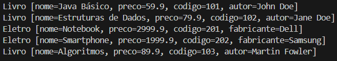

# Sistema de Produtos com Herança em Java

Este projeto implementa um sistema de cadastro de produtos utilizando os conceitos de **herança** e **sobrescrita de métodos** em Java. O sistema envolve três classes principais: `Produto`, `Livro` e `Eletro`, todas encapsuladas em um único arquivo Java. A classe `Main` é usada para criar e exibir uma lista de produtos.

## Funcionalidades

- **Herança**: A classe `Produto` é a superclasse, e `Livro` e `Eletro` são subclasses que herdam seus atributos e métodos.
- **Encapsulamento**: Os modificadores de acesso (privado, protegido e público) são usados para encapsular os atributos adequadamente.
- **Sobrescrita de Métodos**: As classes `Livro` e `Eletro` sobrescrevem o método `toString` para exibir informações específicas de cada tipo de produto.
- **Polimorfismo**: A lista de produtos pode conter objetos tanto da classe `Livro` quanto da classe `Eletro`, todos tratados como `Produto`.

seu-projeto/
├── src/
│   ├── classes/
│   │   ├── produto/
│   │   │   └── Produto.java
│   │   ├── livro/
│   │   │   └── Livro.java
│   │   └── eletro/
│   │       └── Eletro.java
│   └── Main.java
├── .gitignore
└── README.md

## Tecnologias Utilizadas

- **Linguagem**: Java
- **IDE recomendada**: Vscode

## Saída esperada
- Livro [nome=Java Básico, preco=59.9, codigo=101, autor=John Doe]
- Livro [nome=Estruturas de Dados, preco=79.9, codigo=102, autor=Jane Doe]
- Eletro [nome=Notebook, preco=2999.9, codigo=201, fabricante=Dell]
- Eletro [nome=Smartphone, preco=1999.9, codigo=202, fabricante=Samsung]
- Livro [nome=Algoritmos, preco=89.9, codigo=103, autor=Martin Fowler]

